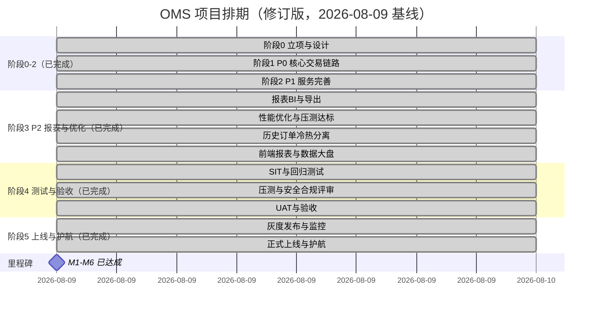

# OMS 项目排期计划（Schedule）

> 本文档由《项目要求.md》第八节拆分而来，与 [项目要求.md](./项目要求.md) 配套维护，需求与非功能要求以其为准。

> **排期说明（2026-08-09 修订）**：原计划按 6–8 人团队、总周期约 24 周推进；实际研发进度远超原计划，**阶段 0–5（立项设计、P0/P1/P2 功能、测试验收、上线与护航）已于 2026-08-09 全部交付**：SIT/安全冒烟/性能压测/合规预评审通过，K8s 编排、监控告警、灰度/回滚、护航与交接文档就绪并完成本地演练，M1–M6 达成。真实生产部署依赖外部资源（生产集群、真实渠道资质），已列入上线检查清单跟踪。

## 0. 实际进度快照（截至 2026-08-09）

| 阶段 | 状态 | 说明 |
| :--- | :--- | :--- |
| 阶段 0 立项与设计 | ✅ 已完成 | Monorepo 骨架、架构与技术栈、ADR、docker-compose 本地环境、开发脚本 |
| 阶段 1 P0 核心交易链路 | ✅ 已完成 | 认证租户、商户资质、商品库存、订单、支付全链路交付；`scripts/e2e-smoke.sh` 通过 |
| 阶段 2 P1 服务完善 | ✅ 已完成 | 售后、物流、第三方平台集成、消息通知、支付对账交付；`scripts/e2e-smoke-phase2.sh` 通过 |
| 阶段 3 P2 报表与优化 | ✅ 已完成 | 报表中心、数据大盘、CSV 导出、Redis 缓存与索引、历史订单冷热分离交付；`scripts/report-smoke.sh` 通过 |
| 阶段 4 测试与验收 | ✅ 已完成 | SIT 29/29、安全冒烟 17/17、压测 P99 达标、合规预评审、验收报告；修复网关 audit-logs 路由缺陷 |
| 阶段 5 上线与护航 | ✅ 已完成 | K8s 编排（7 服务 + HPA + Ingress）、监控告警（Prometheus 7 目标 UP + 5 告警规则）、灰度/回滚演练、护航与交接文档就绪 |

> **口径说明**：支付、物流、第三方电商平台当前为 mock 适配器，真实商户号/平台权限就绪后替换适配器即可，不阻塞代码级联调；但 M6 正式上线以真实渠道资质与 K8s/监控环境就绪为前提。

## 1. 阶段划分与交付物

| 阶段 | 周期（修订后） | 主要工作 | 关键交付物 | 状态 |
| :--- | :--- | :--- | :--- | :--- |
| 阶段 0 立项与设计 | 已达成（08-09） | 需求澄清、技术方案评审、研发环境与 CI/CD 骨架 | PRD/架构文档、ADR、规范落地 | ✅ 已完成 |
| 阶段 1 P0 核心交易链路 | 已达成（08-09） | 用户/权限/资质、商品 SKU、订单、库存、支付中心，管理端/门户核心页面 | 端到端可演示：下单 → 支付 → 发货 → 签收 | ✅ 已完成 |
| 阶段 2 P1 服务完善 | 已达成（08-09） | 售后、物流、第三方平台集成、消息通知、支付对账 | 业务全流程闭环（mock 渠道） | ✅ 已完成 |
| 阶段 3 P2 报表与优化 | 已达成（08-09） | 报表 BI、性能优化、历史订单冷热分离、前端数据大盘 | 报表系统上线、压测脚本与压测说明就绪 | ✅ 已完成 |
| 阶段 4 测试与验收 | 已达成（08-09） | SIT 回归、性能压测、安全测试与合规评审、UAT | 测试报告、验收结论（见 docs/sit/） | ✅ 已完成 |
| 阶段 5 上线与护航 | 已达成（08-09） | K8s 编排、灰度发布与回滚演练、监控告警、上线护航、文档交接与复盘 | 就绪 + 本地演练完成（真实生产部署待外部资源） | ✅ 已完成 |

## 2. 里程碑（Milestones）

| 里程碑 | 原计划 | 修订目标/实际 | 状态 | 验收标准 |
| :--- | :--- | :--- | :--- | :--- |
| M1 方案冻结 | 08-30 | 实际 **08-09** | ✅ 达成 | 需求、技术方案、ADR 落地，架构评审通过 |
| M2 P0 端到端可用 | 10-18 | 实际 **08-09** | ✅ 达成 | 订单/库存/支付主链路冒烟通过（`e2e-smoke.sh`） |
| M3 全流程闭环 | 11-22 | 实际 **08-09** | ✅ 达成 | P1 全流程冒烟通过（`e2e-smoke-phase2.sh`）；代码级闭环，生产上线以 M6 为准 |
| M4 功能冻结 | 12-13 | 实际 **08-09** | ✅ 达成 | P2 完成，不再新增需求，进入测试收敛 |
| M5 UAT 通过 | 01-10 | 实际 **08-09** | ✅ 达成 | 满足项目要求 7.8 验收标准，遗留缺陷无 P0/P1 级 |
| M6 正式上线 | 01-24 | 实际 **08-09**（就绪+演练口径） | ✅ 达成 | 上线就绪：K8s/监控/回滚/护航就绪并演练通过；真实生产部署以渠道资质与生产集群为前置 |

## 3. 人员分工建议

| 角色 | 人数 | 职责 |
| :--- | :--- | :--- |
| 后端开发 | 4 | 按领域拆分：用户/商品、订单、库存、支付与集成 |
| 前端开发 | 2 | 管理端（Vue3 + Arco）、商家门户（React + Arco） |
| 测试 | 1 | SIT 用例设计、回归测试、性能压测、UAT 支持 |
| 架构/DevOps | 1（兼职） | 技术方案、Docker/K8s、CI/CD、监控告警 |
| 产品/项目经理 | 1（兼职） | 需求管理、排期跟踪、风险协调 |

> 实际执行中若团队规模更小，需优先保障阶段 3–4 的测试与 DevOps 投入，避免压缩测试窗口影响 M5/M6。

## 4. 关键依赖与前置风险

- **支付渠道资质**：mock 适配器已就绪；微信/支付宝商户号、国际卡 PSP 真实证书为 **M6 正式上线前置**，建议立即启动申请。
- **第三方平台权限**：天猫/京东开放平台已预留适配器位；若首期权限未获批，可保持 mock 通道，不阻塞主路径。
- **K8s 与监控**：`deploy/k8s/` 目前仅规划，生产编排、ELK/SkyWalking/Prometheus 需在阶段 5 前落地并演练。
- **合规评审**：GSP/UDI、PCI-DSS 预评估需前置，阶段 4 内完成，避免拖后 M6。
- **需求冻结**：M4（08-23）后新增需求一律进入下一迭代，防止排期漂移。
- **关键人依赖**：支付对账、库存预占等核心模块指定 B 角，避免单点阻塞。

## 5. 迭代节奏建议

- P0/P1 已完成一次性快速交付；后续按 **2 周一个 Sprint**（S3–S6）推进，每个 Sprint 结束产出可演示版本。
- 每日站会同步阻塞项；每周发布 Sprint 燃尽图与风险清单。
- 阶段 4 起进入测试收敛期，变更需经变更评审委员会（CCB）批准。

## 6. 阶段任务分解（WBS）

> 人日为原计划预估（含开发与自测）；已完成项状态为 ✅，未开始项为 ⏳，最终以实际投入为准。

| 任务编号 | 阶段 | 任务 | 负责角色 | 预估人日 | 前置依赖 | 状态 |
| :--- | :--- | :--- | :--- | :--- | :--- | :--- |
| WBS-0.1 | 立项设计 | 需求澄清与原型设计 | 产品/前端 | 10 | - | ✅ 已完成 |
| WBS-0.2 | 立项设计 | 技术方案与架构评审 | 架构/后端 | 8 | WBS-0.1 | ✅ 已完成 |
| WBS-0.3 | 立项设计 | 研发环境与 CI/CD 搭建 | DevOps | 5 | WBS-0.2 | ✅ 已完成 |
| WBS-0.4 | 立项设计 | 数据库与中间件选型验证 | 架构/后端 | 4 | WBS-0.2 | ✅ 已完成 |
| WBS-1.1 | P0 核心链路 | 用户/权限/商户入驻与资质审核 | 后端 | 30 | WBS-0.4 | ✅ 已完成 |
| WBS-1.2 | P0 核心链路 | 商品/SKU、UDI 与资质管理 | 后端 | 20 | WBS-0.4 | ✅ 已完成 |
| WBS-1.3 | P0 核心链路 | 订单服务（状态机/拆分/超时） | 后端 | 35 | WBS-1.1、WBS-1.2 | ✅ 已完成 |
| WBS-1.4 | P0 核心链路 | 库存服务（预占/释放/流水） | 后端 | 35 | WBS-1.1 | ✅ 已完成 |
| WBS-1.5 | P0 核心链路 | 支付中心（聚合/回调/退款） | 后端 | 35 | WBS-1.3、渠道资质 | ✅ 已完成（mock） |
| WBS-1.6 | P0 核心链路 | 管理端核心页面（Vue3 + Arco） | 前端 | 40 | 各服务接口 | ✅ 已完成 |
| WBS-1.7 | P0 核心链路 | 商家门户核心页面（React + Arco） | 前端 | 30 | 各服务接口 | ✅ 已完成 |
| WBS-1.8 | P0 核心链路 | 端到端联调与冒烟测试 | 全员 | 15 | WBS-1.6、WBS-1.7 | ✅ 已完成 |
| WBS-2.1 | P1 服务完善 | 售后（退货/换货/维修） | 后端/前端 | 30 | WBS-1.3、WBS-1.5 | ✅ 已完成 |
| WBS-2.2 | P1 服务完善 | 物流（发货/面单/轨迹） | 后端/前端 | 23 | WBS-1.3 | ✅ 已完成（mock） |
| WBS-2.3 | P1 服务完善 | 第三方平台集成 | 后端 | 25 | WBS-1.3、平台权限 | ✅ 已完成（mock） |
| WBS-2.4 | P1 服务完善 | 消息通知（短信/邮件/模板消息） | 后端 | 10 | WBS-1.1 | ✅ 已完成 |
| WBS-2.5 | P1 服务完善 | 支付对账与差错处理 | 后端 | 10 | WBS-1.5 | ✅ 已完成 |
| WBS-2.6 | P1 服务完善 | 全流程联调 | 全员 | 15 | WBS-2.1~2.5 | ✅ 已完成 |
| WBS-3.1 | P2 报表优化 | 报表 BI 与导出 | 后端/前端 | 20 | 核心服务稳定 | ✅ 已完成 |
| WBS-3.2 | P2 报表优化 | 性能优化与压测达标 | 后端/DevOps | 15 | 核心服务稳定 | ✅ 已完成 |
| WBS-3.3 | P2 报表优化 | 历史订单冷热分离 | 后端/DevOps | 10 | WBS-1.3 | ✅ 已完成 |
| WBS-3.4 | P2 报表优化 | 前端报表与数据大盘 | 前端 | 10 | WBS-3.1 | ✅ 已完成 |
| WBS-4.1 | 测试验收 | SIT 用例编写与回归测试 | 测试 | 20 | WBS-2.6 | ✅ 已完成 |
| WBS-4.2 | 测试验收 | 性能压测与调优 | 测试/DevOps | 10 | WBS-3.2 | ✅ 已完成 |
| WBS-4.3 | 测试验收 | 安全测试与合规评审 | 安全/DevOps | 15 | WBS-2.6 | ✅ 已完成 |
| WBS-4.4 | 测试验收 | UAT 组织与缺陷修复 | 全员 | 25 | WBS-4.1 | ✅ 已完成 |
| WBS-4.5 | 测试验收 | 验收报告与上线评审 | 产品/PM | 5 | WBS-4.4 | ✅ 已完成 |
| WBS-5.1 | 上线护航 | K8s 环境落地、灰度发布与回滚演练 | DevOps | 8 | WBS-4.5 | ✅ 已完成（编排+演练脚本） |
| WBS-5.2 | 上线护航 | 监控告警与值班准备 | DevOps | 5 | WBS-5.1 | ✅ 已完成（Prometheus/Alertmanager/规则） |
| WBS-5.3 | 上线护航 | 上线护航与问题处置 | 全员 | 10 | WBS-5.2 | ✅ 已完成（护航手册/Runbook） |
| WBS-5.4 | 上线护航 | 文档交接与项目复盘 | PM/全员 | 5 | WBS-5.3 | ✅ 已完成（交接/复盘文档） |

## 7. Sprint 排期（S1–S6 修订版）

| 迭代 | 日期 | 目标与主要交付 | 里程碑 |
| :--- | :--- | :--- | :--- |
| S1 | 08-09（已完成） | 需求/架构/环境骨架 + P0 全量交付，冒烟通过 | M1、M2 达成（08-09） |
| S2 | 08-09（已完成） | P1 全量交付（售后/物流/集成/通知/对账），冒烟通过 | M3 达成（08-09） |
| S3 | 08-09（已完成） | 报表 BI 与导出、性能优化、历史订单冷热分离、前端数据大盘 | M4 功能冻结达成（08-09） |
| S4 | 08-09（已完成） | SIT 回归、性能压测与调优、安全测试与合规预评估 | - |
| S5 | 08-09（已完成） | UAT、缺陷收敛、合规评审、验收报告与上线评审 | M5 UAT 通过达成（08-09） |
| S6 | 08-09（已完成） | K8s 编排、灰度/回滚演练、监控告警、上线护航与文档交接 | M6 达成（就绪+演练口径，08-09） |

## 8. 关键路径（Critical Path）

- **上线主路径**：P2 报表/性能（S3）→ SIT 与压测、安全/合规与 UAT（S4–S5）→ K8s 灰度与正式上线（S6），**全部完成**。真实生产部署剩余外部依赖：生产集群与真实渠道资质。
- **外部渠道路径**：真实支付商户号/证书（立即启动，最晚 S5 前可用）→ 适配器替换与回归 → M6 正式上线口径。mock 通道可支撑联调，但不支撑生产结算。
- **数据库迁移**：Flyway 迁移脚本随各服务持续演进，S3（M4）起冻结结构变更，否则影响回归与 UAT。
- **可降级项**：第三方平台权限若在 S5 前未获批，WBS-2.3 保持 mock 通道，不阻塞主路径。

## 9. 风险登记册

| 风险 | 概率 | 影响 | 应对措施 | 责任人 |
| :--- | :--- | :--- | :--- | :--- |
| 真实支付渠道资质/证书未按期就绪 | 中 | 高（阻塞 M6 生产结算） | 立即启动申请；已用 mock 联调，证书就绪后替换适配器回归 | 产品/PM |
| K8s 与监控未在阶段 5 前落地 | 中 | 高（阻塞上线） | 阶段 3 起并行搭建 K8s 编排、监控告警，提前演练回滚 | DevOps |
| 进度超前但测试窗口被压缩 | 中 | 中（质量风险） | SIT/压测用例与性能基线前置，M4 后严格冻结需求 | PM/测试 |
| 需求蔓延、未按时冻结 | 高 | 高（整体延期） | M4 后冻结需求；新增需求进 backlog；变更走 CCB | PM |
| 第三方平台权限延迟 | 中 | 中 | 保持 mock 通道；先做沙箱与文档联调 | 后端负责人 |
| 合规评审未通过 | 低 | 高（阻塞上线） | PCI-DSS/GSP/UDI 预评估前置，阶段 4 内完成 | 安全/合规 |
| 核心模块单点依赖 | 低 | 中 | 支付对账、库存预占指定 B 角；文档与知识沉淀 | 后端负责人 |
| 性能压测不达标 | 中 | 高 | 阶段 3 预留优化窗口；上线前完成压测与容量规划 | DevOps/后端 |

## 10. 上线检查清单（Go-Live Checklist）

- [x] 生产环境（K8s、中间件）编排就绪（`deploy/k8s/`，本地演练完成）；真实集群容量/备份验证为外部前置
- [x] 监控告警（Prometheus/Alertmanager 已运行验证，Grafana 就绪；ELK/SkyWalking 为生产规划项）就绪
- [x] 数据库迁移脚本在预发/本地演练通过（Flyway）
- [x] 回滚方案（含数据回滚）演练脚本与手册就绪（`scripts/k8s-rollback-drill.sh`）
- [x] 值班安排与问题升级机制确认（`docs/ops/oncall-runbook.md`）
- [x] 上线后 24–72 小时护航计划确认（`docs/ops/go-live-playbook.md`）
- [x] 部署手册、运维手册、操作手册完成交接（`docs/ops/handover.md`）
- [ ] 支付渠道正式商户号、证书、回调地址配置完成（外部依赖）
- [ ] 域名、HTTPS 证书、OSS、短信/邮件等外部服务配置完成（外部依赖）
- [ ] 镜像安全扫描（Trivy 纳入 CI）与独立渗透测试完成（外部/CI 前置）

## 11. 排期跟踪与变更管理

- 状态约定：**未开始 / 进行中 / 已完成 / 阻塞 / 延期**，WBS 与 Sprint 任务每周更新状态。
- 每周对比实际进度与计划，记录偏差原因，偏差影响里程碑时立即上报 PM。
- 变更流程：影响里程碑或关键路径的变更须经 CCB 评审；新增需求统一进入 backlog，按 P0/P1/P2 重新排期，不插入当前 Sprint。
- 里程碑达成后更新本文档的里程碑表格与甘特图，保证排期始终反映最新计划。

## 12. 更新记录

| 日期 | 说明 |
| :--- | :--- |
| 2026-08-08 | 初版：从《项目要求.md》第八节拆分 |
| 2026-08-08 | 完善：新增 WBS 任务分解、Sprint 排期、关键路径、风险登记册、上线检查清单、排期跟踪与变更管理，甘特图补充 M1–M6 里程碑 |
| 2026-08-09 | 修订：按实际进度重排 — 阶段 0–2（P0/P1）已完成并通过冒烟，M1–M3 达成；新增实际进度快照，重排 P2/测试/上线至 2026-10-04（M4=08-23、M5=09-20、M6=10-04） |
| 2026-08-09 | 阶段 3（P2 报表与优化）完成：报表中心、数据大盘、CSV 导出、Redis 缓存与索引、冷热分离交付，报表冒烟通过；M4 达成（实际 08-09），剩余阶段 4/5 排期不变（M5=09-20、M6=10-04） |
| 2026-08-09 | 阶段 4（测试与验收）完成：SIT 29/29、安全冒烟 17/17、压测 P99 达标、合规预评审与验收报告完成；修复网关 audit-logs 路由缺陷；M5 达成（实际 08-09），剩余阶段 5 上线护航（M6=10-04） |
| 2026-08-09 | 阶段 5（上线与护航）完成：K8s 编排（7 服务 + HPA + Ingress + kustomize）、监控告警（Prometheus 7 目标 UP + 5 规则 + Alertmanager）、灰度/回滚演练、护航 Runbook 与文档交接、项目复盘；修复服务缺失 micrometer-prometheus 指标端点缺陷；M6 达成（就绪+演练口径），真实生产部署转上线清单跟踪 |
