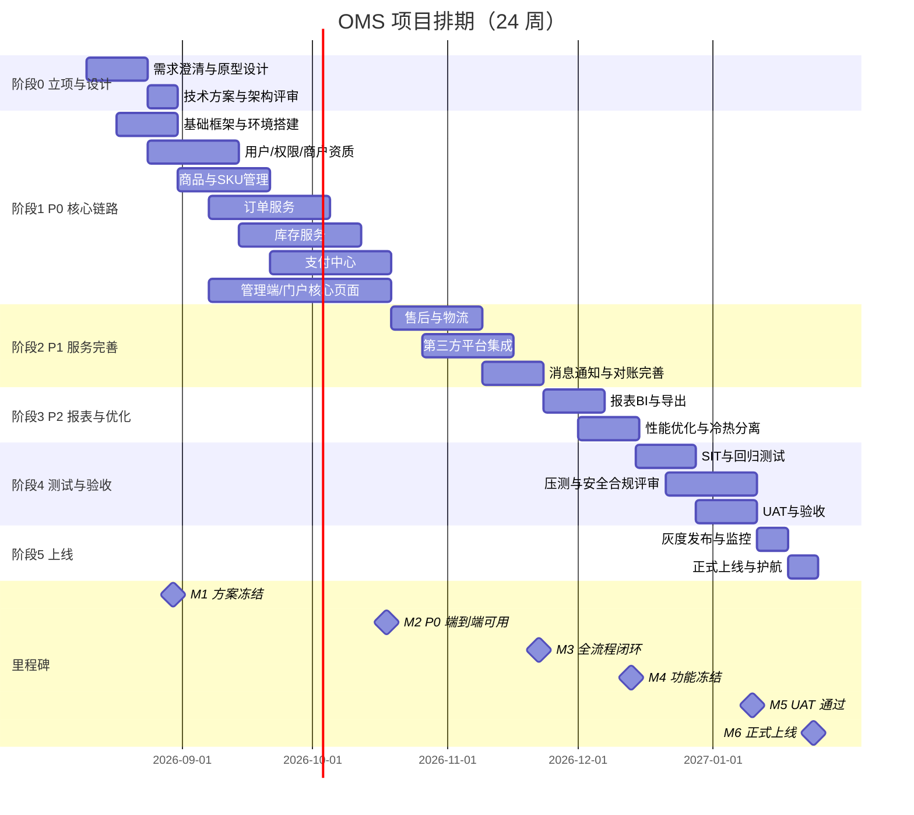

# OMS 项目排期计划（Schedule）

> 本文档由《项目要求.md》第八节拆分而来，与 [项目要求.md](./项目要求.md) 配套维护，需求与非功能要求以其为准。

> **排期假设**：团队规模 6–8 人（后端 4、前端 2、测试 1、架构/DevOps 1 兼职）；外部依赖（支付商户号、第三方平台权限、资质数据）按期到位；总周期约 **24 周（约 5.5 个月）**，可根据团队规模压缩或延长。

## 1. 阶段划分与交付物

| 阶段 | 周期 | 主要工作 | 关键交付物 |
| :--- | :--- | :--- | :--- |
| 阶段 0 立项与设计 | 第 1–3 周 | 需求澄清、原型设计、技术方案评审、研发环境与 CI/CD 就绪 | PRD/原型、架构文档、项目规范落地 |
| 阶段 1 P0 核心交易链路 | 第 3–10 周 | 用户/权限/资质、商品 SKU、订单、库存、支付中心，及管理端/门户核心页面 | 端到端可演示：下单 → 支付 → 发货 |
| 阶段 2 P1 服务完善 | 第 11–15 周 | 售后、物流、第三方平台集成、消息通知、对账完善 | 业务全流程闭环 |
| 阶段 3 P2 报表与优化 | 第 16–18 周 | 报表 BI、性能优化、历史订单冷热分离 | 报表系统上线、压测达标 |
| 阶段 4 测试与验收 | 第 19–22 周 | SIT 回归、UAT、性能压测、安全测试与合规评审 | 测试报告、验收结论 |
| 阶段 5 上线与护航 | 第 23–24 周 | 灰度发布、监控告警、上线支持 | 正式环境上线 |

## 2. 里程碑（Milestones）

| 里程碑 | 时间节点 | 验收标准 |
| :--- | :--- | :--- |
| M1 方案冻结 | 第 3 周末 | 需求、原型、技术方案评审通过 |
| M2 P0 端到端可用 | 第 10 周末 | 订单/库存/支付主链路可完整演示，通过冒烟测试 |
| M3 全流程闭环 | 第 15 周末 | P1 功能全部上线，含售后、物流、对账 |
| M4 功能冻结 | 第 18 周末 | P2 完成，不再新增需求，进入测试收敛 |
| M5 UAT 通过 | 第 22 周末 | 满足项目要求 7.8 验收标准，遗留缺陷无 P0/P1 级 |
| M6 正式上线 | 第 24 周末 | 灰度稳定、监控告警就绪、上线后护航结束 |

## 3. 人员分工建议

| 角色 | 人数 | 职责 |
| :--- | :--- | :--- |
| 后端开发 | 4 | 按领域拆分：用户/商品、订单、库存、支付与集成 |
| 前端开发 | 2 | 管理端（Vue3 + Arco）、商家门户（React + Arco） |
| 测试 | 1 | SIT 用例设计、回归测试、UAT 支持 |
| 架构/DevOps | 1（兼职） | 技术方案、Docker/K8s、CI/CD、监控告警 |
| 产品/项目经理 | 1（兼职） | 需求管理、排期跟踪、风险协调 |

## 4. 关键依赖与前置风险

- **支付渠道资质**：微信/支付宝商户号、国际卡 PSP 申请与证书下发周期约 1–4 周，建议立项后立即启动。
- **合规评审**：PCI-DSS、GSP/UDI 等合规要求可能影响上线时间，需在阶段 4 前完成预评估。
- **第三方平台权限**：天猫/京东开放平台应用权限申请周期不可控，若影响首期可降级为二期（P1 顺延）。
- **需求冻结**：阶段 3 后新增需求一律进入下一迭代，防止排期漂移。
- **关键人依赖**：支付对账、库存预占等核心模块需指定 B 角，避免单点阻塞。

## 5. 迭代节奏建议

- 采用 **2 周一个 Sprint**，每个 Sprint 结束产出可演示版本，需求按 P0/P1/P2 排序进入迭代。
- 每日站会同步阻塞项；每周发布 Sprint 燃尽图与风险清单。
- 阶段 4 起进入测试收敛期，变更需经变更评审委员会（CCB）批准。

## 6. 阶段任务分解（WBS）

> 人日为预估工作量（含开发与自测），可根据实际团队产能调整。

| 任务编号 | 阶段 | 任务 | 负责角色 | 预估人日 | 前置依赖 |
| :--- | :--- | :--- | :--- | :--- | :--- |
| WBS-0.1 | 立项设计 | 需求澄清与原型设计 | 产品/前端 | 10 | - |
| WBS-0.2 | 立项设计 | 技术方案与架构评审 | 架构/后端 | 8 | WBS-0.1 |
| WBS-0.3 | 立项设计 | 研发环境与 CI/CD 搭建 | DevOps | 5 | WBS-0.2 |
| WBS-0.4 | 立项设计 | 数据库与中间件选型验证 | 架构/后端 | 4 | WBS-0.2 |
| WBS-1.1 | P0 核心链路 | 用户/权限/商户入驻与资质审核 | 后端 | 30 | WBS-0.4 |
| WBS-1.2 | P0 核心链路 | 商品/SKU、UDI 与资质管理 | 后端 | 20 | WBS-0.4 |
| WBS-1.3 | P0 核心链路 | 订单服务（状态机/拆分/超时） | 后端 | 35 | WBS-1.1、WBS-1.2 |
| WBS-1.4 | P0 核心链路 | 库存服务（预占/释放/流水） | 后端 | 35 | WBS-1.1 |
| WBS-1.5 | P0 核心链路 | 支付中心（聚合/回调/退款） | 后端 | 35 | WBS-1.3、渠道资质 |
| WBS-1.6 | P0 核心链路 | 管理端核心页面（Vue3 + Arco） | 前端 | 40 | 各服务接口 |
| WBS-1.7 | P0 核心链路 | 商家门户核心页面（React + Arco） | 前端 | 30 | 各服务接口 |
| WBS-1.8 | P0 核心链路 | 端到端联调与冒烟测试 | 全员 | 15 | WBS-1.6、WBS-1.7 |
| WBS-2.1 | P1 服务完善 | 售后（退货/换货/维修） | 后端/前端 | 30 | WBS-1.3、WBS-1.5 |
| WBS-2.2 | P1 服务完善 | 物流（发货/面单/轨迹） | 后端/前端 | 23 | WBS-1.3 |
| WBS-2.3 | P1 服务完善 | 第三方平台集成 | 后端 | 25 | WBS-1.3、平台权限 |
| WBS-2.4 | P1 服务完善 | 消息通知（短信/邮件/模板消息） | 后端 | 10 | WBS-1.1 |
| WBS-2.5 | P1 服务完善 | 支付对账与差错处理 | 后端 | 10 | WBS-1.5 |
| WBS-2.6 | P1 服务完善 | 全流程联调 | 全员 | 15 | WBS-2.1~2.5 |
| WBS-3.1 | P2 报表优化 | 报表 BI 与导出 | 后端/前端 | 20 | 核心服务稳定 |
| WBS-3.2 | P2 报表优化 | 性能优化与压测达标 | 后端/DevOps | 15 | 核心服务稳定 |
| WBS-3.3 | P2 报表优化 | 历史订单冷热分离 | 后端/DevOps | 10 | WBS-1.3 |
| WBS-3.4 | P2 报表优化 | 前端报表与数据大盘 | 前端 | 10 | WBS-3.1 |
| WBS-4.1 | 测试验收 | SIT 用例编写与回归测试 | 测试 | 20 | WBS-2.6 |
| WBS-4.2 | 测试验收 | 性能压测与调优 | 测试/DevOps | 10 | WBS-3.2 |
| WBS-4.3 | 测试验收 | 安全测试与合规评审 | 安全/DevOps | 15 | WBS-2.6 |
| WBS-4.4 | 测试验收 | UAT 组织与缺陷修复 | 全员 | 25 | WBS-4.1 |
| WBS-4.5 | 测试验收 | 验收报告与上线评审 | 产品/PM | 5 | WBS-4.4 |
| WBS-5.1 | 上线护航 | 灰度发布与回滚演练 | DevOps | 5 | WBS-4.5 |
| WBS-5.2 | 上线护航 | 监控告警与值班准备 | DevOps | 5 | WBS-5.1 |
| WBS-5.3 | 上线护航 | 上线护航与问题处置 | 全员 | 10 | WBS-5.2 |
| WBS-5.4 | 上线护航 | 文档交接与项目复盘 | PM/全员 | 5 | WBS-5.3 |

## 7. Sprint 排期（S1–S12）

| 迭代 | 日期 | 目标与主要交付 | 里程碑 |
| :--- | :--- | :--- | :--- |
| S1 | 08-10 ~ 08-23 | 需求澄清、原型设计 | - |
| S2 | 08-24 ~ 09-06 | 技术方案与架构评审、基础框架与环境搭建 | M1 方案冻结（08-30） |
| S3 | 09-07 ~ 09-20 | 用户/权限/商户资质、商品与 SKU 管理 | - |
| S4 | 09-21 ~ 10-04 | 订单服务、库存预占/释放核心 | - |
| S5 | 10-05 ~ 10-18 | 支付中心联调、管理端/门户核心页面 | M2 端到端可用（10-18） |
| S6 | 10-19 ~ 11-01 | 售后、物流 | - |
| S7 | 11-02 ~ 11-15 | 第三方平台集成、消息通知 | - |
| S8 | 11-16 ~ 11-29 | 对账完善、全流程闭环 | M3 全流程闭环（11-22） |
| S9 | 11-30 ~ 12-13 | 报表 BI、性能优化、冷热分离 | M4 功能冻结（12-13） |
| S10 | 12-14 ~ 12-27 | SIT 回归、性能压测、缺陷修复 | - |
| S11 | 12-28 ~ 01-10 | UAT、安全测试与合规评审 | M5 UAT 通过（01-10） |
| S12 | 01-11 ~ 01-24 | 灰度发布、正式上线与护航 | M6 正式上线（01-24） |

## 8. 关键路径（Critical Path）

- **支付链路**：渠道资质申请（立即启动，最晚 S4 前可用）→ 支付中心开发 → 支付回调联调 → M2 端到端可用。该路径上任何延迟都会直接推后 M2，需最高优先级保障。
- **交易主链路**：商品/资质 → 订单 → 库存预占/释放 → 支付 → 发货，任一环节阻塞将影响全流程演示与验收。
- **数据库迁移**：Flyway 迁移脚本随各服务持续演进，阶段 4 前必须冻结结构变更，否则影响回归与 UAT。
- **可降级项**：第三方平台权限若在 M3 前未获批，WBS-2.3 降级至 v1.1，不阻塞主路径。

## 9. 风险登记册

| 风险 | 概率 | 影响 | 应对措施 | 责任人 |
| :--- | :--- | :--- | :--- | :--- |
| 支付渠道资质/证书延迟 | 中 | 高（阻塞 M2） | 立项即启动申请；准备备用 PSP；先用沙箱环境联调 | 产品/PM |
| 需求蔓延、未按时冻结 | 高 | 高（整体延期） | 阶段 3 后冻结需求；新增需求进 backlog 排期；变更走 CCB | PM |
| 第三方平台权限延迟 | 中 | 中 | 降级至 v1.1；先做沙箱与文档联调 | 后端负责人 |
| 合规评审未通过 | 低 | 高（阻塞上线） | PCI-DSS/GSP 预评估前置，阶段 4 前完成 | 安全/合规 |
| 核心模块单点依赖 | 低 | 中 | 支付对账、库存预占指定 B 角；文档与知识沉淀 | 后端负责人 |
| 联调环境不稳定 | 中 | 中 | docker-compose 保证本地一致；测试环境专人维护 | DevOps |
| 性能压测不达标 | 中 | 高 | 阶段 3 预留优化窗口；上线前完成压测与容量规划 | DevOps/后端 |

## 10. 上线检查清单（Go-Live Checklist）

- [ ] 生产环境（K8s、中间件）就绪，容量与备份验证通过
- [ ] 支付渠道正式商户号、证书、回调地址配置完成
- [ ] 域名、HTTPS 证书、OSS、短信/邮件等外部服务配置完成
- [ ] 监控告警（ELK、SkyWalking、Prometheus/Grafana）全部就绪并验证
- [ ] 数据库迁移脚本在预发环境演练通过
- [ ] 回滚方案（含数据回滚）演练通过
- [ ] 镜像安全扫描与合规评审通过
- [ ] 值班安排与问题升级机制确认
- [ ] 上线后 24–72 小时护航计划确认
- [ ] 部署手册、运维手册、操作手册完成交接

## 11. 排期跟踪与变更管理

- 状态约定：**未开始 / 进行中 / 已完成 / 阻塞 / 延期**，WBS 与 Sprint 任务每周更新状态。
- 每周对比实际进度与计划，记录偏差原因，偏差影响里程碑时立即上报 PM。
- 变更流程：影响里程碑或关键路径的变更须经 CCB 评审；新增需求统一进入 backlog，按 P0/P1/P2 重新排期，不插入当前 Sprint。
- 里程碑达成后更新本文档的里程碑表格与甘特图，保证排期始终反映最新计划。

## 12. 更新记录

| 日期 | 说明 |
| :--- | :--- |
| 2026-08-08 | 初版：从《项目要求.md》第八节拆分 |
| 2026-08-08 | 完善：新增 WBS 任务分解、Sprint 排期、关键路径、风险登记册、上线检查清单、排期跟踪与变更管理，甘特图补充 M1–M6 里程碑 |
