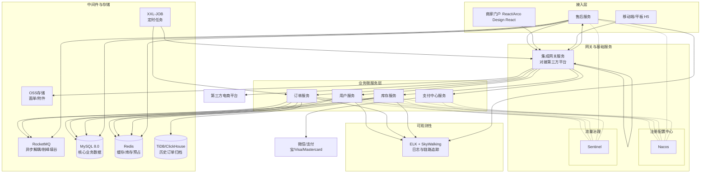

这是一个雄心勃勃且架构非常清晰的企业级项目。基于你提供的技术栈蓝图，结合医疗设备行业的特殊性和主流实践，我将为你构建这份可落地的技术方案。

核心思路是：**以Spring Cloud Alibaba微服务生态为骨架，以多渠道支付聚合为血脉，以数据一致性、高可用和合规性为生命线。**

---

### 一、 系统总体架构设计

采用微服务架构，依据业务领域进行服务拆分，实现高内聚、低耦合。

### 二、 核心技术栈与模块划分

#### 2.1 微服务模块拆分

| 服务模块 | 核心职责 | 关键数据库表 |
| :--- | :--- | :--- |
| **用户服务** | 用户注册/登录、权限管理(RBAC)、商户/客户信息管理、资质证照上传与审核（医疗设备合规关键） | `user`, `role`, `permission`, `merchant_info`, `qualification` |
| **订单服务** | 订单生成、状态流转、支付回调处理、订单拆分/合并、订单详情查询 | `order`, `order_item`, `order_payment`, `order_log` |
| **库存服务** | 库存管理、入库/出库操作、**库存预占与释放**、安全库存预警、库存流水记录 | `sku`, `warehouse`, `inventory`, `inventory_transaction` |
| **售后服务** | 售后申请（退货/换货/维修）、售后审核、退款流程、服务单跟踪 | `return_order`, `return_item`, `refund_record` |
| **集成网关服务** | 对接第三方电商平台（如天猫、京东）的订单拉取、物流轨迹同步 | `external_order_mapping`, `logistics_tracking` |
| **支付中心服务** | 聚合支付接口，统一封装微信、支付宝、Visa、Mastercard调用，处理支付结果通知 | `payment_channel`, `payment_transaction` |

> 这一拆分逻辑与步长制药OMS等大型医疗项目的实践一致，即围绕订单生命周期的核心节点进行领域划分。

#### 2.2 关键技术组件选型

*   **服务治理**：**Nacos** 作为注册中心和配置中心，实现服务发现与动态配置刷新。
*   **流量管控**：**Sentinel** 在网关层配置流控规则，对秒杀或大促场景进行熔断降级，保障核心服务稳定。例如，可针对“下单”接口设置限流阈值。
*   **异步与解耦**：**RocketMQ** 用于三个核心场景：
    *   **订单回调**：支付成功后，异步通知订单服务更新状态。
    *   **物流推送**：订单发货后，异步通知物流服务或集成网关同步轨迹。
    *   **库存变更**：订单创建时异步扣减库存，利用MQ的削峰填谷能力应对高并发。
*   **分布式事务**：在“下单-预占库存-扣减余额”等强一致性场景，考虑引入 **Seata** 的AT模式或TCC模式，确保数据最终一致性。
*   **数据存储策略**：
    *   **主库MySQL**：存储订单、用户等核心业务数据，读写分离。
    *   **Redis缓存**：缓存热点SKU信息、渠道配置、用户会话；利用其原子操作实现**库存预占**。
    *   **TiDB/ClickHouse**：当MySQL订单表数据量达到亿级时，通过DTS或定时任务将已完成的订单同步到TiDB（兼容MySQL协议，扩展性强）或ClickHouse（分析性能极佳）用于历史查询和BI报表分析。TiDB相比传统分库分表方案，在运维复杂度和在线扩展能力上更有优势。

### 三、 多渠道支付接入方案

同时接入微信、支付宝、Visa和Mastercard，核心是**聚合支付**模式。

1.  **统一接口**：在**支付中心服务**中抽象出统一的支付接口，定义标准化的请求参数（订单号、金额、币种、支付方式）和回调处理流程。
2.  **适配器模式**：为每个支付渠道实现独立的适配器（Adapter）。
    *   **微信支付/支付宝**：集成其官方SDK，处理扫码支付、H5支付、小程序支付等。
    *   **Visa/Mastercard**：通常通过与国际卡收单行或支付服务商（Payment Service Provider, PSP）合作接入。例如，Payment Asia、BBMSL等平台能提供统一的API，一次接入即可同时支持Visa、Mastercard、银联、微信、支付宝。你需要申请此类服务商的商户账号，获取API密钥和证书。
3.  **安全合规**：所有支付请求必须通过HTTPS，敏感信息（如卡号、CVV）不落盘，直接透传给支付网关，系统需通过**PCI-DSS**合规认证或使用服务商提供的托管页面。

### 四、 核心业务场景技术实现

#### 4.1 库存预占与订单超时处理

这是OMS系统的核心难点，医疗设备单价高、库存精准度要求极高。

1.  **预占库存**：用户下单时，库存服务在Redis中利用`DECR`操作预占库存，成功后订单服务才生成订单。
2.  **支付超时释放**：订单生成后，向RocketMQ发送一条**延迟消息**（如30分钟后）。若30分钟内未收到支付成功回调，消费者消费该消息，触发库存回滚（`INCR`），并将订单状态置为“已取消”。
3.  **支付成功扣减**：支付回调成功后，发送消息**异步**通知库存服务进行物理库存扣减，并清除Redis中的预占记录。整个链路通过状态机严格控制，避免超卖。

#### 4.2 海量历史订单归档策略

1.  **冷热分离**：通过XXL-Job定时任务，每天凌晨将“已完成”且“超过1年”的订单从MySQL主库迁移至TiDB或ClickHouse。
2.  **查询路由**：在订单查询接口中，通过**AOP**或**策略模式**判断查询时间范围。若涉及历史数据，自动路由到归档库查询，对前端透明。

### 五、 部署与运维体系

1.  **容器化部署**：所有微服务、中间件构建Docker镜像，通过Kubernetes（K8s）编排部署。利用K8s的HPA（Horizontal Pod Autoscaler）根据CPU或自定义监控指标（如RocketMQ消息积压量）实现弹性伸缩。
2.  **可观测性**：
    *   **日志**：应用日志通过Filebeat采集至ELK（Elasticsearch, Logstash, Kibana）集中存储和检索。
    *   **链路追踪**：集成SkyWalking，通过agent方式收集调用链数据，快速定位慢服务和接口异常。
3.  **CI/CD**：建立完整的DevOps流水线，代码提交触发自动构建、单元测试、镜像扫描，并滚动更新到K8s集群。

### 六、 风险与应对

*   **支付回调丢失/重复**：支付结果必须辅以XXL-Job定时主动查询，并实现**幂等性处理**（通过唯一事务ID）。
*   **分布式事务问题**：在“下单-扣库存-生成支付单”等长事务中，建议采用**TCC（Try-Confirm-Cancel）** 模式或**事务消息**（RocketMQ）保证最终一致性。
*   **数据一致性**：库存、订单、积分等数据变更，需建立完善的**对账系统**，每日进行平账检查。

---

### 七、项目要求（补充）

> 以下为需求层面的补充说明，与上述技术方案一一对应。优先级说明：**P0** = 首期上线必须；**P1** = 首期后尽快补齐；**P2** = 规划期。

#### 7.1 功能需求（FR）

**F1 用户与组织权限（P0）**

- 支持多租户体系：平台运营方、商户、终端客户三级组织模型。
- RBAC 权限模型：角色、菜单、按钮、数据权限（按商户/仓库/部门隔离）。
- 商户入驻流程：注册、资质提交、审核、启用/停用、合同与账期管理。
- 操作审计：登录、下单、改价、审核、退款等关键操作全程留痕，记录操作人、时间、前后值。

**F2 商品与资质管理（P0）**

- SPU/SKU 模型：支持规格、批号、序列号、效期、注册证号等医疗器械特有属性。
- 医疗器械资质管理：注册证、生产许可证、经营许可证、备案凭证绑定到商品或类目，支持上传、审核、**到期自动预警**；资质过期时禁止新增销售。
- UDI（唯一器械标识）管理：商品与 UDI 码关联，支持扫码出入库与追溯。
- 价格体系：渠道价、客户协议价、促销价、阶梯价；改价需审核并留痕。

**F3 订单全生命周期（P0）**

- 下单：B2B（商户下单）与 B2C（终端客户）场景；支持购物车、批量导入下单。
- 订单状态机：待支付 → 已支付 → 已审核 → 已发货 → 已签收 → 已完成；支持取消、拒收、售后介入等分支；状态流转必须有严格校验与日志。
- 订单拆分/合并：按仓库、物流、商品批次拆分；支持合并支付。
- 订单修改：改价、改地址、改物流需权限控制并记录审批流。
- 超时处理：待支付订单超过设定时限（默认 30 分钟，可配置）自动取消并释放库存。
- 异常处理：重复支付、支付金额不一致、风控拦截等异常订单进入人工处理队列。

**F4 库存管理（P0）**

- 多仓库、多仓位模型；支持批次与效期管理，先进先出（FEFO）出库。
- 库存操作：预占、释放、扣减、回补、冻结/解冻；所有变动写库存流水（`inventory_transaction`）。
- 出入库：采购入库、销售出库、退换货入库、盘盈盘亏、报废。
- 预警：安全库存预警、效期临期预警、滞销预警；支持短信/邮件/站内消息通知。
- 盘点：支持盲盘、抽盘，盘点差异生成差异单并走审批。

**F5 支付与对账（P0）**

- 聚合支付：统一接入微信、支付宝、Visa、Mastercard，前端根据渠道/币种展示对应支付方式。
- 支付能力：扫码支付、H5 支付、小程序支付、国际卡支付；支持部分支付（定金+尾款）、余额支付。
- 退款：原路退回、人工转账退款；退款需走审核流程，记录退款流水。
- 对账：每日自动拉取渠道账单与本地支付流水逐笔核对，差异单自动生成并支持人工处理。
- 幂等与防重：同一订单重复支付、重复回调必须被拦截或安全处理。

**F6 售后服务（P1）**

- 售后类型：退货、换货、维修；支持整单或部分商品申请。
- 流程：申请 → 审核 → 收货质检 → 退款/换货发运/维修 → 完成。
- 维修管理：维修工单、维修进度、维修记录与费用。
- 售后与订单、支付、库存联动：退款触发支付中心，退货入库触发库存回补。

**F7 物流管理（P1）**

- 发货单、出库单、面单打印（对接快递公司电子面单）。
- 物流轨迹：对接快递 100、顺丰等接口，主动查询与回调推送。
- 签收确认：支持客户签收、异常签收登记。

**F8 第三方平台集成（P1）**

- 对接天猫、京东等电商平台：订单拉取、发货回传、库存同步、售后单同步。
- 平台商品映射、订单映射（`external_order_mapping`）与幂等处理，防止重复建单。

**F9 消息通知（P1）**

- 通知渠道：短信、邮件、站内信、微信模板消息。
- 通知场景：下单成功、支付成功/失败、发货、签收、资质到期、库存预警、售后状态变更。
- 通知模板可配置，发送失败重试并记录日志。

**F10 报表与 BI（P2）**

- 经营报表：销售、毛利、订单来源、客单价、复购率。
- 库存报表：周转率、滞销、效期分布、仓库库存。
- 支付报表：渠道交易、退款率、对账差异。
- 售后报表：退货率、维修时长、售后原因分布。
- 支持定时生成与导出（Excel/CSV）。

#### 7.2 非功能需求（NFR）

| 类别 | 要求 |
| :--- | :--- |
| 性能 | 下单、支付回调等核心接口 **P99 ≤ 500ms**；普通查询 **P99 ≤ 1s**；支持大促峰值 **5,000 QPS**（可按业务规模调整目标值） |
| 可用性 | 核心交易链路可用性 ≥ **99.95%**；支付链路目标 ≥ 99.99%；RTO ≤ 30 分钟，RPO ≤ 5 分钟 |
| 安全 | 全链路 HTTPS；敏感数据（手机号、证件、银行卡号）加密存储、脱敏展示；接口签名与防重放；关键操作防篡改 |
| 合规 | 满足医疗器械经营质量管理规范（GSP）、UDI 追溯要求；涉海外业务需满足 GDPR 及数据出境合规 |
| 可扩展性 | 所有无状态服务支持水平扩展；数据库、缓存、消息队列具备平滑扩容能力 |
| 可维护性 | 统一日志、链路追踪、配置中心、灰度发布、快速回滚 |
| 审计 | 与钱、库存、资质相关的操作必须可追溯、可审计、不可抵赖 |

#### 7.3 业务规则要求

- 库存预占规则：下单即预占，支付成功后才物理扣减；超时未支付自动释放。
- 效期规则：临期（如剩余效期不足 6 个月）商品默认禁止销售，需特殊审批放行。
- 资质规则：商品所关联的注册证/经营资质过期时，自动下架并禁止下单。
- 价格规则：实际成交价不得低于协议价下限，低于下限需走审批。
- 退款规则：未发货订单支持全额退款；已发货订单按退货流程处理。
- 对账规则：本地流水与渠道账单差异超过 24 小时未处理需升级告警。

#### 7.4 接口与集成要求

- 统一 RESTful API 风格与响应报文格式（`code` / `message` / `data`），全局错误码规范。
- 接口版本化（`/v1`、`/v2`），向后兼容至少一个大版本。
- 写接口支持幂等键（`Idempotency-Key`），防止重复提交。
- 外部回调接口需验签 + 防重放 + 限流，回调处理失败自动重试（至少 5 次，指数退避）。
- 对外提供 OpenAPI 文档，并维护每个接口的字段说明、示例与变更记录。

#### 7.5 Docker 容器化部署要求

- **基础镜像**：所有服务采用多阶段构建，运行时镜像基于精简基础镜像（如 Alpine / distroless），最终镜像不包含构建工具、源码与多余依赖。
- **镜像规范**：统一命名与标签规则（`仓库地址/项目名/服务名:版本`），版本与 Git commit 关联，使用不可变标签，禁止覆盖发布（如复用 `latest`）。
- **健康检查**：Dockerfile 定义 `HEALTHCHECK`，应用暴露健康检查端点（如 Spring Boot `/actuator/health`），供 K8s 的 liveness/readiness 探针使用。
- **资源限制**：所有容器必须显式声明 CPU、内存的 `requests` 与 `limits`，防止单服务资源争抢拖垮集群。
- **日志规范**：应用日志统一输出到 stdout/stderr，由 Filebeat 等采集，禁止在容器内写本地日志文件（或仅少量滚动文件）。
- **配置管理**：环境相关配置通过环境变量 / 配置中心（Nacos）注入，禁止烧录进镜像；数据库密码、支付密钥、证书等敏感信息使用 Secret 管理，严禁明文写入镜像或仓库。
- **安全要求**：镜像构建完成后进行漏洞扫描（如 Trivy），存在高危漏洞阻断发布；容器以非 root 用户运行，最小化权限与暴露端口。
- **环境一致性**：提供 docker-compose 一键启动本地开发环境（MySQL、Redis、RocketMQ、Nacos、OSS 模拟器等），保证本地与生产环境行为一致。
- **CI/CD 集成**：代码提交触发镜像构建、单元测试与扫描，通过后推送至私有镜像仓库，并滚动更新至 K8s 集群。

#### 7.6 前端设计规范（Arco Design）

- **技术选型**：管理端（Vue3）采用 **Arco Design Vue**，商家门户（React）采用 **Arco Design React**；移动端/平板 H5 界面遵循 Arco Design 设计语言实现。
- **设计令牌（Design Token）**：全局统一色板、字体、字号、间距、圆角、阴影，支持亮色/暗色主题切换；品牌定制通过主题配置（如 `ConfigProvider`）完成，禁止散落硬编码样式值。
- **组件规范**：统一使用 Arco 官方组件库，不重复造轮子；业务组件须基于 Arco 组件二次封装，并沉淀到内部组件库统一维护。
- **布局规范**：管理端采用标准后台布局（侧边导航 + 顶栏 + 内容区），商家门户采用营销/业务混合布局；所有页面适配桌面与平板 H5 的常见分辨率，关键流程不允许横向滚动。
- **交互与状态规范**：表单校验、加载态、空态、异常态、确认弹窗等统一按 Arco 规范实现；按钮加载、禁用、危险操作等状态语义一致。
- **国际化与无障碍**：界面支持中英文切换（i18n），文本不硬编码；遵循 Arco 无障碍（Accessibility）规范，关键操作支持键盘可达。
- **验收要求**：前端页面交付前须通过 Arco Design 规范视觉走查，与设计稿一致性达标后方可验收。

#### 7.7 项目规范（工程与协作规范）

**编码与风格规范**

- 后端（Java）：遵循《阿里巴巴 Java 开发手册》，统一包结构与分层（`controller` / `service` / `mapper` / `entity` / `dto` / `constant`）；提交前通过 Checkstyle / Spotless 检查与格式化。
- 前端：使用 TypeScript 强类型；Vue3 统一 `<script setup>` + Composition API，React 统一 Hooks 写法；提交前通过 ESLint + Prettier 检查与自动格式化，禁止提交带 lint 报错的代码。
- SQL：统一编码风格，复杂查询禁止在业务代码中拼字符串 SQL，必须使用参数化查询或 MyBatis-Plus 等规范写法。

**命名规范**

- 微服务/模块：小写字母 + 连字符（如 `order-service`、`payment-center`），与镜像名、K8s 服务名保持一致。
- 接口：RESTful 资源命名，路径使用小写复数名词（如 `/api/v1/orders`）。
- 数据库：表名、字段名统一小写下划线命名；表名单数（如 `user`、`order_item`）；主键 `id`；时间字段 `created_at` / `updated_at`；软删除 `deleted`；版本号 `version`。

**Git 与分支规范**

- 分支模型：`main` 为发布分支，`develop` 为集成分支，功能分支 `feature/xxx`，缺陷修复 `hotfix/xxx`，发版分支 `release/x.y.z`。
- 提交信息：遵循 Conventional Commits（`feat` / `fix` / `docs` / `refactor` / `test` / `chore`），并关联需求或缺陷单号。
- 合并流程：禁止直接提交 `main`；所有变更通过 PR/MR 合并，必须经过至少 1 人 Code Review，CI 通过且无高危问题后方可合并。

**目录结构规范**

- 仓库建议采用 Monorepo 结构：`backend/`（微服务代码）、`frontend/`（管理端与商家门户）、`docs/`（文档）、`deploy/`（Docker、K8s、CI/CD 配置）、`scripts/`（工具脚本）。
- 前端统一目录：`src/api`、`src/components`、`src/views`、`src/router`、`src/store`、`src/utils`、`src/styles`；页面与路由、菜单、权限点一一对应。

**数据库规范**

- 所有表结构变更通过 Flyway / Liquibase 迁移脚本管理，禁止手工修改线上库。
- 金额统一使用 `DECIMAL(18,2)`，时间统一使用 `DATETIME`（存储 UTC），状态字段使用 TINYINT 并配合字典表/枚举说明。
- 索引命名：普通索引 `idx_字段名`，唯一索引 `uk_字段名`；高频查询必须建索引，禁止在索引列上做函数运算。
- 核心业务表禁止物理删除（软删除），删除或变更需保留审计痕迹。

**测试规范**

- 单元测试覆盖率目标：核心服务模块（订单、库存、支付）≥ 70%，其余模块 ≥ 50%。
- 关键链路必须有自动化用例：下单、支付回调、退款、库存预占/释放、超时取消、对账差异处理。
- 合并前必须通过：单元测试、接口联调测试、前端 E2E 冒烟用例、镜像安全扫描。

**文档与协作规范**

- 每个服务/前端应用必须提供 README：职责说明、本地启动方式、环境变量与配置项、常用命令。
- 接口变更同步更新 OpenAPI 文档；需求与规则变更同步更新本文档（项目要求），保持需求、设计、代码一致。
- 重大架构或技术选型决策记录为 ADR（Architecture Decision Record），存档于 `docs/adr/`。

**版本规范**

- 统一采用语义化版本（SemVer，`主版本.次版本.修订号`）；版本号与镜像 tag、发布分支、发布记录保持一致。

#### 7.8 验收标准

1. P0 功能全部上线且通过 UAT，订单、库存、支付三条主链路端到端无阻断缺陷。
2. 核心接口压测达到 7.2 节性能指标，且超卖、重复支付、重复回调等风险用例全部通过。
3. 支付对账连续 7 个自然日差异为 0（或全部差异可解释并处理完毕）。
4. 库存账实相符率 100%，库存流水可完整追溯。
5. 关键操作审计日志覆盖率达到 100%，日志可查询、不可篡改。
6. 通过安全测试（渗透测试）与合规评审，满足 7.2 节合规要求后方可上线。

---

### 八、项目排期计划（Schedule）

完整的排期计划（甘特图、阶段划分、里程碑、人员分工、关键依赖与迭代节奏）已拆分为独立文件，详见 [SCHEDULE.md](./SCHEDULE.md)。
